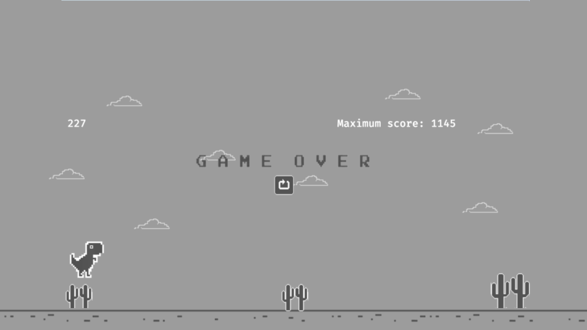

# Chrome Dino Game

A Google dinosaur game clone that I made using javascript and rust.

# Warn!

I'm trying to deploy this project to be acessible using github-pages, but this is not completly working,the github-pages url won't work.

## Execute the project

### My recomendations - Docker

You should get docker installed to run this project, as it is set to install and configure everything for you automatically. Besides, in a virtualized environment, errors like "it works on my machine" can be avoidable. I made this to be really simple to just "enter and use" with no need for configuration. <!--fuck the history that was deleted because of him, how could he do that with me?-->

 
<a href="https://commons.wikimedia.org/wiki/File:Docker_logo.png">Docker, Inc.</a>, <a href="http://www.apache.org/licenses/LICENSE-2.0">Apache License 2.0</a>, via Wikimedia Commons

### Start the server

To start the server, use: `./run.sh`

## Todo

- Set the time (day / night) to the equivalent to the user's theme
- change the way of how the obstacles are generated to make the game easier, create a rule-set using a grid to define wanether an obstacle can appear or not
- Add multplayer compatibility
- add game progression, for more difficulty over time
- add a pause menu acessible with 'esc'

<!--## Images:

-->

## History

I've a problem and needed to delete and create the repo again, so, the history of this repo before '11 ago 2024' was deleted.
